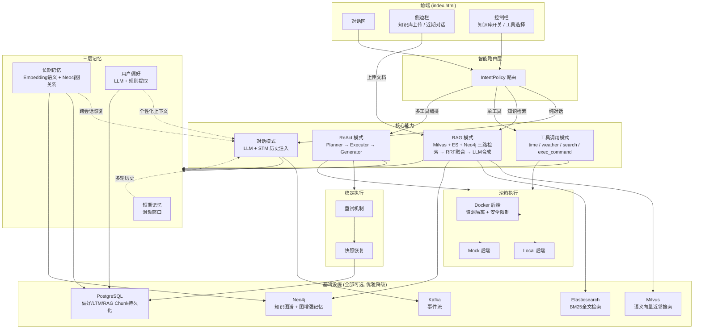
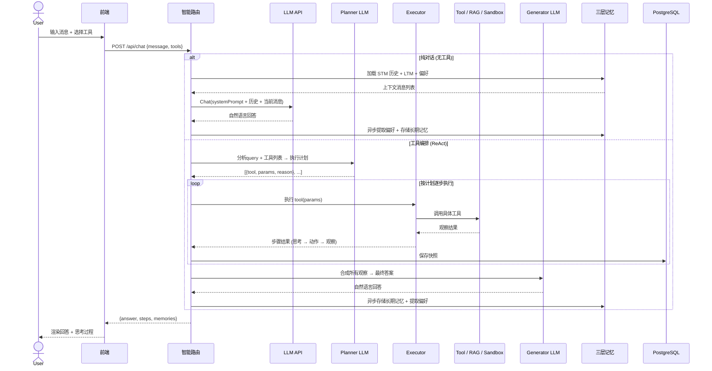
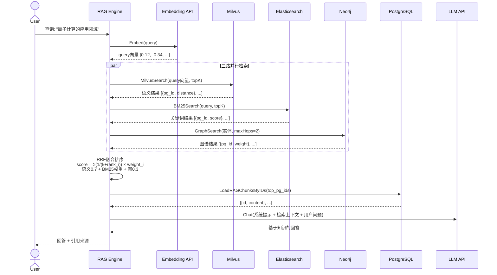

# VenAgent — AI 智能体系统

VenAgent 是一个面向个人的 AI 智能体系统，融合了检索增强生成（RAG）、三层记忆、知识图谱、沙箱执行与可恢复执行流，支持多轮对话、知识检索、工具调用与复杂推理。系统具备高可用性、可扩展性与工程落地能力。

## 项目特性

- **多模式智能体核心**：支持纯对话、RAG 检索、单工具调用、多工具编排（ReAct）等多种模式，由 IntentPolicy 自动路由。
- **RAG 检索增强生成**：融合 Milvus 语义向量、Elasticsearch BM25 关键词、Neo4j 知识图谱，三路 RRF 融合排序，自动降级，支持文档分块与异步实体关系抽取。
- **三层记忆系统**：短期记忆（滑动窗口）、长期记忆（Embedding + TF 双层）、用户偏好（LLM + 规则），支持去重、合并、衰减、过期淘汰。
- **图增强记忆**：长期记忆叠加 Neo4j 图层，支持 FOLLOWS、SIMILAR_TO、CAUSES、BELONGS_TO 等关系，提升历史联想与推理能力。
- **工具链与可恢复执行**：内置时间、天气、搜索、RAG 检索、命令执行等工具，支持 ReAct 规划-执行-生成流程，任务快照与重试机制保障稳定性。
- **沙箱执行**：支持 Docker / Local / Mock 三种沙箱后端，资源限制（CPU/内存/PID/网络），命令白名单安全校验。
- **高可用基础设施**：PostgreSQL 持久化、Milvus/ES/Neo4j/Kafka 可选，自动优雅降级，适配多种部署环境。

---

## 整体架构图



---

## 核心流程时序图



---

## RAG 三路混合检索流程图



---

## 技术实现亮点

- **RAG 检索增强**：
    - 支持三路混合检索（Milvus 语义向量、ES BM25 关键词、Neo4j 知识图谱），RRF 融合排序。
    - 文本分块采用窗口重叠，提升召回覆盖率。
    - 检索模式自动切换，单路故障自动降级，支持企业级高可用。

- **三层记忆系统**：
    - 短期记忆：滑动窗口保存最近 N 轮对话。
    - 长期记忆：Embedding + TF 双层，支持去重、合并、衰减、过期淘汰。
    - 偏好记忆：LLM + 规则自动提取用户偏好，持久化跨会话恢复。

- **图增强记忆**：
    - 记忆写入时自动建立时序（FOLLOWS）、相似（SIMILAR_TO）等关系。
    - 支持图扩展召回，发现间接关联历史记忆。
    - 合并淘汰时保护高中心度节点，防止核心知识丢失。

- **智能体与工具链**：
    - 路由优先级：ReAct 复合推理 > 单工具 > RAG 检索 > 纯对话。
    - 工具链支持自定义扩展，RAG 检索作为知识库工具无缝集成。
    - ReAct 规划-执行-生成流程，任务快照与重试机制保障稳定性。

- **沙箱执行**：
    - 支持 Docker（资源隔离 + 安全限制）、Local（直接执行）、Mock（测试）三种后端。
    - 命令长度限制、白名单校验、资源配额（CPU/内存/PID/网络/只读文件系统）。

- **工程与基础设施**：
    - PostgreSQL 持久化所有关键数据。
    - Milvus/ES/Neo4j/Kafka 可选，自动降级，适配多种部署环境。
    - 前后端解耦，支持多端接入。

---

## 快速开始

### 本地运行

```bash
# 1. 安装依赖
pip install -r final/requirements.txt

# 2. 启动基础设施（需要 Docker）
cd final
docker-compose up -d

# 3. 配置 LLM API Key
# 编辑 final/config/config.yaml，填入 llm.api_key 和 embedding.api_key

# 4. 启动应用
cd final && python main.py

# 5. 访问 http://localhost:8090
```

> 所有基础设施（Milvus/PG/ES/Kafka/Neo4j）均为可选，连接失败自动降级为内存模式，不影响启动。

### 配置

编辑 `final/config/config.yaml`，填入 API Key：

- `llm.api_key` — OpenAI 兼容对话模型 API Key（DeepSeek / 火山方舟等）
- `embedding.api_key` — Embedding 模型 API Key

---

## 目录结构

```
final/
├── config/                   配置加载（YAML → Python 数据类）
│   ├── config.py
│   └── config.yaml
├── internal/
│   ├── agent/                智能体核心与调度（ReAct + Harness + 路由）
│   ├── agentteam/            多 Agent 协作（预设合约 + 注册表）
│   ├── document/             文档管理（解析 + 版本化 + 入库）
│   ├── graph/                知识图谱（Neo4j 实体关系抽取 + 图检索 + 任务图）
│   ├── handler/              HTTP API 路由处理 + SSE 流式
│   ├── infra/                基础设施连接（Milvus / PG / ES / Kafka）
│   ├── llm/                  LLM/Embedding 客户端（OpenAI 兼容 + Mock 降级）
│   ├── memory/               三层记忆系统（短期 / 长期 / 用户偏好 + 图增强）
│   ├── platform/             各平台客户端薄封装（Milvus / PG / ES / Neo4j / Kafka）
│   ├── promptctx/            Prompt 上下文装配系统
│   ├── rag/                  RAG 引擎（三路混合检索 + RRF 融合 + 查询改写 + 重排序）
│   ├── repo/                 各领域持久化仓储
│   ├── sandbox/              沙箱执行（Docker / Local / Mock + 安全校验）
│   └── tools/                工具定义与调用（time / weather / search / exec_command / MCP）
├── frontend/                 单文件前端 HTML
├── tests/                    ~50 个单元测试文件
├── main.py                   入口
├── requirements.txt          Python 依赖
└── docker-compose.yml        基础设施编排
```

---

## 重构状态

当前项目基于 Python + FastAPI 实现，后续计划引入 LangChain/LangGraph。目前处于 **Phase 1** 重构阶段，正在对核心模块进行边界抽取与架构标准化。

- ✅ 已完成：IntentPolicy 策略层、MCP 工具边界抽出、agentteam 合约定义
- 🔄 进行中：边界实现加固、兼容路径清理
- 📋 计划中（Phase 2）：将自研图执行引擎迁移到 LangGraph StateGraph（`agent/langgraph/` 已包含过渡实现）

设计文档见 `docs/SDD/`。

---

## License

MIT

## 致谢

本项目受 AI 智能体、RAG、知识图谱、记忆增强等前沿研究启发，欢迎交流与合作。
