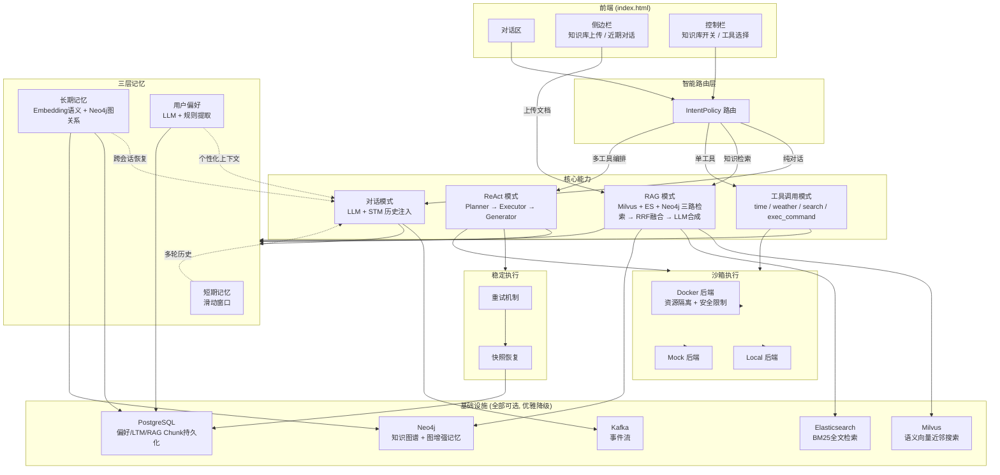
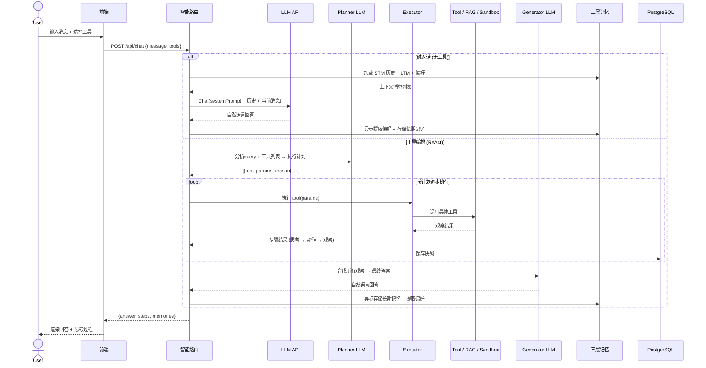
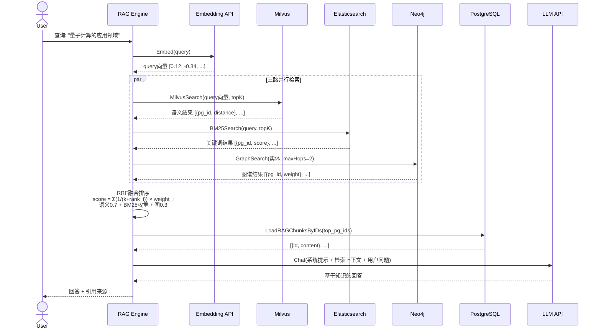

# VenAgent — AI 智能体系统

VenAgent 是一个面向个人的 AI 智能体系统，融合了检索增强生成（RAG）、三层记忆、知识图谱、沙箱执行与可恢复执行流，支持多轮对话、知识检索、工具调用与复杂推理。系统具备高可用性、可扩展性与工程落地能力。

## 项目特性

- **多模式智能体核心**：支持纯对话、RAG 检索、单工具调用、多工具编排（ReAct）等多种模式，由 IntentPolicy 自动路由。
- **RAG 检索增强生成**：融合 Milvus 语义向量、Elasticsearch BM25 关键词、Neo4j 知识图谱，三路 RRF 融合排序，自动降级，支持文档分块与异步实体关系抽取。
- **三层记忆系统**：短期记忆（滑动窗口）、长期记忆（Embedding + TF 双层）、用户偏好（LLM + 规则），支持去重、合并、衰减、过期淘汰。
- **图增强记忆**：长期记忆叠加 Neo4j 图层，支持 FOLLOWS、SIMILAR_TO、CAUSES、BELONGS_TO 等关系，提升历史联想与推理能力。
- **工具链与可恢复执行**：内置时间、天气、搜索、RAG 检索、命令执行等工具，支持 ReAct 规划-执行-生成流程，任务快照与重试机制保障稳定性。
- **沙箱执行**：支持 Docker / Local / Mock 三种沙箱后端，资源限制（CPU/内存/PID/网络），命令白名单安全校验。
- **高可用基础设施**：PostgreSQL 持久化、Milvus/ES/Neo4j/Kafka 可选，自动优雅降级，适配多种部署环境。

---

## 整体架构图


```mermaid
graph TB
    subgraph Frontend["前端 (index.html)"]
        CHAT["对话区"]
        SIDEBAR["侧边栏<br/>知识库上传 / 近期对话"]
        CTRL["控制栏<br/>知识库开关 / 工具选择"]
    end

    subgraph Router["智能路由层"]
        R["IntentPolicy 路由"]
    end

    subgraph Core["核心能力"]
        CHAT_ENGINE["对话模式<br/>LLM + STM 历史注入"]
        RAG_ENGINE["RAG 模式<br/>Milvus + ES + Neo4j 三路检索 → RRF融合 → LLM合成"]
        TOOL_ENGINE["工具调用模式<br/>time / weather / search / exec_command"]
        REACT_ENGINE["ReAct 模式<br/>Planner → Executor → Generator"]
    end

    subgraph Memory["三层记忆"]
        STM["短期记忆<br/>滑动窗口"]
        LTM["长期记忆<br/>Embedding语义 + Neo4j图关系"]
        PREF["用户偏好<br/>LLM + 规则提取"]
    end

    subgraph Harness["稳定执行"]
        RETRY["重试机制"]
        SNAP["快照恢复"]
    end

    subgraph Sandbox["沙箱执行"]
        DOCKER["Docker 后端<br/>资源隔离 + 安全限制"]
        LOCAL["Local 后端"]
        MOCK["Mock 后端"]
    end

    subgraph Infra["基础设施 (全部可选, 优雅降级)"]
        PG["PostgreSQL<br/>偏好/LTM/RAG Chunk持久化"]
        MIL["Milvus<br/>语义向量近邻搜索"]
        ES["Elasticsearch<br/>BM25全文检索"]
        NEO["Neo4j<br/>知识图谱 + 图增强记忆"]
        KAFKA["Kafka<br/>事件流"]
    end

    CHAT --> R
    CTRL --> R

    R -->|纯对话| CHAT_ENGINE
    R -->|知识检索| RAG_ENGINE
    R -->|单工具| TOOL_ENGINE
    R -->|多工具编排| REACT_ENGINE

    CHAT_ENGINE --> Memory
    RAG_ENGINE --> Memory
    TOOL_ENGINE --> Memory
    REACT_ENGINE --> Memory
    REACT_ENGINE --> Harness

    TOOL_ENGINE --> Sandbox
    REACT_ENGINE --> Sandbox
    Sandbox --> DOCKER
    Sandbox --> LOCAL
    Sandbox --> MOCK

    RETRY --> SNAP
    SNAP --> PG

    STM -.->|多轮历史| CHAT_ENGINE
    LTM -.->|跨会话恢复| CHAT_ENGINE
    PREF -.->|个性化上下文| CHAT_ENGINE

    LTM --> PG
    LTM --> NEO
    PREF --> PG
    RAG_ENGINE --> MIL
    RAG_ENGINE --> ES
    RAG_ENGINE --> NEO
    CHAT_ENGINE --> KAFKA

    SIDEBAR -->|上传文档| RAG_ENGINE
```

---

## 核心流程时序图


```mermaid
sequenceDiagram
    actor User
    participant FE as 前端
    participant Router as 智能路由
    participant LLM as LLM API
    participant Planner as Planner LLM
    participant Executor as Executor
    participant Tool as Tool / RAG / Sandbox
    participant Generator as Generator LLM
    participant Memory as 三层记忆
    participant DB as PostgreSQL

    User->>FE: 输入消息 + 选择工具
    FE->>Router: POST /api/chat {message, tools}

    alt 纯对话 (无工具)
        Router->>Memory: 加载 STM 历史 + LTM + 偏好
        Memory-->>Router: 上下文消息列表
        Router->>LLM: Chat(systemPrompt + 历史 + 当前消息)
        LLM-->>Router: 自然语言回答
        Router->>Memory: 异步提取偏好 + 存储长期记忆

    else 工具编排 (ReAct)
        Router->>Planner: 分析query + 工具列表 → 执行计划
        Planner-->>Router: [{tool, params, reason}, ...]

        loop 按计划逐步执行
            Router->>Executor: 执行 tool(params)
            Executor->>Tool: 调用具体工具
            Tool-->>Executor: 观察结果
            Executor-->>Router: 步骤结果 (思考 → 动作 → 观察)
            Router->>DB: 保存快照
        end

        Router->>Generator: 合成所有观察 → 最终答案
        Generator-->>Router: 自然语言回答
        Router->>Memory: 异步存储长期记忆 + 提取偏好
    end

    Router-->>FE: {answer, steps, memories}
    FE-->>User: 渲染回答 + 思考过程
```

---

## RAG 三路混合检索流程图


```mermaid
sequenceDiagram
    actor User
    participant RAG as RAG Engine
    participant EMB as Embedding API
    participant MIL as Milvus
    participant ES as Elasticsearch
    participant NEO as Neo4j
    participant PG as PostgreSQL
    participant LLM as LLM API

    User->>RAG: 查询: "量子计算的应用领域"
    RAG->>EMB: Embed(query)
    EMB-->>RAG: query向量 [0.12, -0.34, ...]

    par 三路并行检索
        RAG->>MIL: MilvusSearch(query向量, topK)
        MIL-->>RAG: 语义结果 [{pg_id, distance}, ...]
        RAG->>ES: BM25Search(query, topK)
        ES-->>RAG: 关键词结果 [{pg_id, score}, ...]
        RAG->>NEO: GraphSearch(实体, maxHops=2)
        NEO-->>RAG: 图谱结果 [{pg_id, weight}, ...]
    end

    RAG->>RAG: RRF融合排序<br/>score = Σ(1/(k+rank_i)) × weight_i<br/>语义0.7 + BM25权重 + 图0.3

    RAG->>PG: LoadRAGChunksByIDs(top_pg_ids)
    PG-->>RAG: [{id, content}, ...]

    RAG->>LLM: Chat(系统提示 + 检索上下文 + 用户问题)
    LLM-->>RAG: 基于知识的回答

    RAG-->>User: 回答 + 引用来源
```

---

## 技术实现亮点

- **RAG 检索增强**：
    - 支持三路混合检索（Milvus 语义向量、ES BM25 关键词、Neo4j 知识图谱），RRF 融合排序。
    - 文本分块采用窗口重叠，提升召回覆盖率。
    - 检索模式自动切换，单路故障自动降级，支持企业级高可用。

- **三层记忆系统**：
    - 短期记忆：滑动窗口保存最近 N 轮对话。
    - 长期记忆：Embedding + TF 双层，支持去重、合并、衰减、过期淘汰。
    - 偏好记忆：LLM + 规则自动提取用户偏好，持久化跨会话恢复。

- **图增强记忆**：
    - 记忆写入时自动建立时序（FOLLOWS）、相似（SIMILAR_TO）等关系。
    - 支持图扩展召回，发现间接关联历史记忆。
    - 合并淘汰时保护高中心度节点，防止核心知识丢失。

- **智能体与工具链**：
    - 路由优先级：ReAct 复合推理 > 单工具 > RAG 检索 > 纯对话。
    - 工具链支持自定义扩展，RAG 检索作为知识库工具无缝集成。
    - ReAct 规划-执行-生成流程，任务快照与重试机制保障稳定性。

- **沙箱执行**：
    - 支持 Docker（资源隔离 + 安全限制）、Local（直接执行）、Mock（测试）三种后端。
    - 命令长度限制、白名单校验、资源配额（CPU/内存/PID/网络/只读文件系统）。

- **工程与基础设施**：
    - PostgreSQL 持久化所有关键数据。
    - Milvus/ES/Neo4j/Kafka 可选，自动降级，适配多种部署环境。
    - 前后端解耦，支持多端接入。

---

## 快速开始

### 本地运行

```powershell
python -m venv .venv
.\.venv\Scripts\python.exe -m pip install -e ".[dev]"
Copy-Item .env.example .env
# 编辑被 Git 忽略的 .env；模板内每组变量都注明用途和安全边界。
.\.venv\Scripts\python.exe -m venagent
```

访问 `http://127.0.0.1:8090`。完全不配置任何 `LLM_*` 变量时，应用使用无网络的本地回复模型。

### 对话与图记忆持久化（PostgreSQL + Neo4j）

本机无需安装 PostgreSQL 或 Neo4j，可直接使用根目录 Docker Compose 服务：

```powershell
$env:POSTGRES_PASSWORD = "仅用于本机开发的密码"
$env:NEO4J_PASSWORD = "另一个仅用于本机开发的密码"
docker compose up -d postgres neo4j
.\.venv\Scripts\python.exe -m venagent migrate
.\.venv\Scripts\python.exe -m venagent
```

`migrate` 是唯一建立或升级 PostgreSQL 业务/checkpointer schema 与 M05 Neo4j constraints 的入口；普通启动只做兼容性检查，不静默执行 DDL。PostgreSQL 不可用时聊天退化到进程内模式；Neo4j 不可用时只停用 G1 图增益，PostgreSQL 普通长期事实仍可召回。

后端启动时会以自然中文逐项输出已接入的基础设施状态和最终汇总。未配置依赖与连接或 schema 故障会使用不同的稳定原因和文案；日志不会显示密码、完整连接串或原始异常。

### 项目级检查与真实 PostgreSQL 测试

Ruff 属于 `dev` extra，只安装在项目虚拟环境中，不要求全局安装：

```powershell
.\.venv\Scripts\python.exe -m pip install -e ".[dev]"
.\.venv\Scripts\python.exe -m ruff check venagent tests
```

真实 PostgreSQL 测试必须使用独立的 `venagent_test` 数据库。真实 Neo4j 测试只在显式配置 `TEST_NEO4J_URI` 时运行，并使用测试 owner/label 范围清理，不能对共享图执行全局删除：

```powershell
docker compose exec postgres createdb -U venagent -O venagent venagent_test
$env:TEST_DATABASE_URL = "postgresql://venagent:<本地密码>@127.0.0.1:5432/venagent_test"
.\.venv\Scripts\python.exe -m pytest -q tests\test_persistence.py
$env:TEST_NEO4J_URI = "bolt://127.0.0.1:7687"
$env:TEST_NEO4J_PASSWORD = "<本地 Neo4j 密码>"
.\.venv\Scripts\python.exe -m pytest -q tests\test_neo4j_graph_memory.py
```

测试连接不得指向开发数据库 `venagent`；未配置专用连接时，真实数据库用例会明确显示为 skipped。

### 配置

真实模型统一通过 `.env` 或显式进程环境中的 `LLM_*` 白名单配置。支持的 provider：

| provider | 额外必需配置 | 说明 |
| --- | --- | --- |
| `openai` | 无 | 官方 OpenAI；可省略自定义 API root |
| `openai_compatible` | `BASE_URL` 或 `ENDPOINT_URL` 二选一 | OpenAI-compatible 第三方服务 |
| `azure_openai` | `AZURE_ENDPOINT`、`AZURE_DEPLOYMENT`、`API_VERSION` | Azure OpenAI 原生 adapter |
| `anthropic` | 无 | Anthropic 原生 adapter |
| `google_genai` | 无 | Google Gemini 原生 adapter |

OpenAI-family 默认使用 `LLM_API_MODE=chat_completions`，也可选择 `responses`。例如配置 `LLM_BASE_URL=https://api.example.com/v1` 与 `LLM_API_MODE=responses` 时，最终请求地址为 `/v1/responses`。`LLM_BASE_URL` 表示 SDK API root；`LLM_ENDPOINT_URL` 表示完整的 `/chat/completions` 或 `/responses` 地址。两者不能同时配置，配置层也不会猜测并自动追加 `/v1`。

可选类型化参数包括：

- `reasoning_effort`
- `temperature`（`0..2`）
- `max_tokens`（正整数）
- `timeout`（正数秒）
- `max_retries`（非负整数）
- `verbosity`（`low` / `medium` / `high`）
- `extra_body`（经过保留字段检查的 JSON object）

`reasoning_effort` 与 `verbosity` 当前只用于 OpenAI-family/Azure。Anthropic/Gemini 的原生 thinking 配置通过 `EXTRA_BODY_JSON` 传入；配置层不会在不同厂商间猜测式换算强度。

配置优先级为内建安全默认值、仓库根 `.env`、显式进程环境变量。应用只读取 `.env.example` 中记录的白名单；未知的包含双下划线的结构化键会快速失败。PostgreSQL、认证、服务端口和 LLM 均使用环境变量，秘密不会写入日志或错误。只要出现任意非空 `LLM_*` 字段，配置就必须完整合法，否则应用在启动装配阶段失败；不会静默回退并伪装为真实模型成功。

---

## 目录结构

当前渐进式运行时采用按能力优先的 package layout：

```text
venagent/                                      # 当前 M01--M05 Python 运行时
├── __init__.py                                # 稳定公开 API
├── __main__.py                                # serve/migrate CLI 入口
├── bootstrap.py                               # 唯一 feature adapter composition root
├── agent/                                     # AgentRun 与 LangGraph 执行能力
│   ├── __init__.py                            # agent 稳定导出
│   ├── errors.py                              # run 领域错误
│   ├── graph.py                               # LangGraph 编译与 checkpoint serializer
│   ├── observation.py                         # 在线观察发布/订阅，不保存运行事实
│   ├── ports.py                               # RunStore 与模型调用消费方端口
│   ├── runs.py                                # AgentRun 生命周期、claim 与 fencing
│   ├── runtime.py                             # 调度、执行、恢复、取消与 façade
│   └── state.py                               # 继续 LangGraph 所需的运行 State
├── conversation/                              # 对话、正式消息与 run 创建用例
│   ├── __init__.py                            # conversation 稳定导出
│   ├── errors.py                              # 对话领域错误
│   ├── models.py                              # Conversation/Message/RunCreation 值对象
│   ├── ports.py                               # ConversationStore 消费方端口
│   ├── rules.py                               # 输入、标识符与自动标题规则
│   └── service.py                             # owner-scoped conversation 用例
├── ownership/                                 # owner、user、session 与身份授权
│   ├── __init__.py                            # ownership 稳定导出
│   ├── errors.py                              # 身份、session 与授权错误
│   ├── models.py                              # Actor/Owner/Session/RunGrant 值对象
│   ├── ports.py                               # OwnershipStore/密码/token 端口
│   └── service.py                             # 注册、登录、refresh 与删除用例
├── memory/                                    # M05 记忆授权、生命周期、召回与管理
│   ├── __init__.py                            # MemoryService/command 稳定导出
│   ├── authorization.py                       # MemoryAuthorizer 与 request snapshot
│   ├── capabilities.py                        # Health/Settings 与能力状态注册表
│   ├── command_adapter.py                     # /memory 解析与 MemoryCommandResult
│   ├── errors.py                              # 记忆领域与安全错误
│   ├── graph.py                               # 纯 G1 关系规则
│   ├── model_adapters.py                      # extractor/judge/summary 模型适配
│   ├── jobs.py                                # job 值对象、dispatch、retry 与 fencing
│   ├── job_worker.py                          # lifespan polling worker
│   ├── management.py                          # 查询、更新、删除、确认与开关用例
│   ├── ports.py                               # memory 消费方窄端口与组合端口
│   ├── recall.py                              # 授权后 short/long/G1 候选召回与排序
│   ├── service.py                             # 显式组合协作者的稳定 façade
│   ├── short_term.py                          # turn 选择、摘要构建与校验
│   ├── embedding/                             # M05 embedding 与派生索引边界
│   │   ├── __init__.py                        # index/port 稳定导出
│   │   └── index.py                           # owner 范围向量投影与余弦召回
│   ├── graph_memory/                          # GraphMemory 应用边界
│   │   ├── __init__.py                        # GraphMemory 稳定导出
│   │   └── service.py                         # 权威 store 到图 store 的 G1 用例
│   └── long_term/                             # 长期事实、策略与写入行为
│       ├── __init__.py                        # 长期事实稳定导出
│       ├── facts.py                           # MemoryFact/Source/Page 值对象
│       ├── conflict.py                        # ADD/UPDATE/NOOP/QUARANTINE 决策
│       ├── extractor.py                       # 严格候选 schema 与原文 span 校验
│       ├── policy.py                          # 提取、资格、安全、相似度规则
│       └── writer.py                          # LongTermWriter 版本化与隔离处理
├── promptctx/                                 # 模型调用上下文的通用唯一所有者
│   ├── __init__.py                            # context/schema/assembler 稳定导出
│   ├── assembler.py                           # 确定性投影、placement 与 token 预算
│   ├── context.py                             # ContextBlock/ModelCallContext/BudgetReport
│   ├── errors.py                              # 投影配置与 overflow 错误
│   ├── recall_provider.py                     # 合格 memory 候选转 ContextBlock
│   ├── schema.py                              # SectionSpec/ProjectionPolicy/角色策略
│   └── source.py                              # 类型化 ContextSource 合约与基础来源
├── repo/                                      # feature port 的具体 adapters
│   ├── __init__.py                            # repository adapter package 标识
│   ├── postgresql/                            # PostgreSQL feature adapters
│   │   ├── __init__.py                        # PostgreSQL adapter 稳定导出
│   │   ├── conversation.py                    # ConversationStore SQL 行为
│   │   ├── conversation_mapping.py            # conversation/message/run 共享行映射
│   │   ├── conversation_runtime.py            # conversation/run 薄共享 façade
│   │   ├── ownership.py                       # OwnershipStore 及 ownership 行映射
│   │   ├── runs.py                            # RunStore SQL、claim 与 fencing
│   │   └── memory/                            # PostgreSQL memory authority adapters
│   │       ├── __init__.py                    # 完整 PostgresMemoryStore 组合
│   │       ├── index.py                       # PostgreSQL real[] 派生向量 adapter
│   │       ├── jobs.py                        # durable job/fencing 持久化
│   │       ├── long_term.py                   # 长期事实、来源与确认持久化
│   │       ├── row_mapping.py                 # memory 数据库 row 映射
│   │       └── short_term.py                  # conversation summary 持久化
│   ├── temporary/                             # 进程内 feature adapters
│   │   ├── __init__.py                        # temporary adapter 稳定导出
│   │   ├── conversation.py                    # 进程内 conversation 行为
│   │   ├── conversation_runtime.py            # 共享 state 的 conversation/run 薄 façade
│   │   ├── ownership.py                       # 进程内 owner/session adapter
│   │   ├── runs.py                            # 进程内 run、claim 与 fencing 行为
│   │   ├── state.py                           # conversation/ownership/run 共享进程状态
│   │   └── memory/                            # 进程内 memory adapters
│   │       ├── __init__.py                    # TemporaryMemoryStore/graph 稳定导出
│   │       ├── fact_state.py                  # tombstone/redaction/确认哈希 helper
│   │       ├── graph.py                       # 测试与 temporary G1 graph store
│   │       ├── index.py                       # 进程内派生向量 adapter
│   │       ├── jobs.py                        # 进程内 job 状态与 claim
│   │       ├── long_term.py                   # 进程内事实、来源与确认
│   │       ├── short_term.py                  # 进程内 summary store
│   │       └── state.py                       # 完整 TemporaryMemoryStore 组合状态
│   └── neo4j/                                 # Neo4j feature adapters
│       ├── __init__.py                        # Neo4j memory adapter 稳定导出
│       └── memory_graph.py                    # durable G1 edge adapter
├── platform/                                  # 共享技术资源与运行期能力
│   ├── __init__.py                            # 平台状态、runtime 与迁移稳定导出
│   ├── errors.py                              # 连接、迁移与 schema 错误
│   ├── observability.py                       # 启动报告与结构化状态日志
│   ├── runtime.py                             # backend-neutral 资源/状态/lifecycle façade
│   ├── postgresql/                            # PostgreSQL 技术资源
│   │   ├── __init__.py                        # PostgreSQL runtime/migration 导出
│   │   ├── migrations.py                     # 业务与 LangGraph schema 迁移
│   │   └── runtime.py                         # pool、schema 校验与 checkpointer 生命周期
│   ├── neo4j/                                 # Neo4j 技术资源
│   │   ├── __init__.py                        # Neo4j runtime/migration 导出
│   │   ├── migrations.py                     # 显式 graph schema migration/validation
│   │   └── runtime.py                         # driver 生命周期与安全降级
│   └── security/                              # ownership 的技术安全 adapters
│       ├── __init__.py                        # password/token 稳定导出
│       ├── passwords.py                       # Argon2 密码哈希 adapter
│       └── tokens.py                          # JWT access/refresh token adapter
├── llm/                                       # 模型配置与 provider adapter
│   ├── __init__.py                            # runtime model factory 稳定导出
│   ├── config.py                              # provider 配置解析与校验
│   ├── embeddings.py                          # M05/M08 通用 /embeddings HTTP adapter
│   ├── factory.py                             # 模型实例选择与装配
│   └── providers.py                           # provider factory 与参数映射
├── config/                                    # 环境配置边界
│   ├── __init__.py                            # AppConfig 与 loader 稳定导出
│   └── loader.py                              # .env 白名单加载与 Pydantic 校验
└── interfaces/                                # 外部 transport adapters
    ├── __init__.py                            # interfaces package 标识
    └── http/                                  # FastAPI/HTTP/SSE 边界
        ├── __init__.py                        # app/create_app 稳定导出
        ├── app.py                             # app、health、Web UI 与 lifespan 协调
        ├── auth.py                            # cookie、origin 与 actor 解析
        ├── errors.py                          # 领域错误到 HTTP 错误映射
        ├── schemas.py                         # HTTP Pydantic 请求/响应模型
        ├── streaming.py                       # run snapshot/token SSE 投影
        └── routes/                            # 按消费面拆分的 endpoint 注册
            ├── __init__.py                    # route group 稳定注册入口
            ├── auth.py                        # 身份、session 与账号 routes
            ├── conversations.py               # conversation 查询/重命名/删除 routes
            └── runs.py                        # run 创建/重试/取消/SSE routes

web/                                           # Vue 3 前端；生产构建由 FastAPI 托管
├── src/modules/                               # chat、ownership 等前端能力模块
├── tests/e2e/                                 # Playwright 端到端验收
└── vite.config.ts                             # 开发代理与构建配置
```

依赖方向为 `interfaces → feature services/ports ← repo adapters`。`repo/` 只实现 feature ports，`platform/` 只管理共享技术资源；具体 adapter 只在 `bootstrap.py` 装配。PostgreSQL feature adapters 接收 `platform/postgresql/runtime.py` 创建的同步业务连接池，不自行读取 DSN、创建连接池或关闭连接。LangGraph 官方异步 checkpointer 使用独立池，但仍由同一个 PostgreSQL runtime 统一管理生命周期；Neo4j driver 同理由 `platform/neo4j/runtime.py` 管理。`promptctx/` 只装配已授权候选，memory 拥有授权、生命周期与召回排序，agent 拥有运行编排。当前 HTTP 层不取得原始数据库连接。

以下 `final/` 目录保留为旧项目实现与功能参考，不是当前渐进式运行时的包边界。

```
final/
├── config/                   legacy 配置加载（历史 YAML → Python 数据类）
│   ├── config.py
│   └── config.yaml
├── internal/
│   ├── agent/                智能体核心与调度（ReAct + Harness + 路由）
│   ├── agentteam/            多 Agent 协作（预设合约 + 注册表）
│   ├── document/             文档管理（解析 + 版本化 + 入库）
│   ├── graph/                知识图谱（Neo4j 实体关系抽取 + 图检索 + 任务图）
│   ├── handler/              HTTP API 路由处理 + SSE 流式
│   ├── infra/                基础设施连接（Milvus / PG / ES / Kafka）
│   ├── llm/                  LLM/Embedding 客户端（OpenAI 兼容 + Mock 降级）
│   ├── memory/               三层记忆系统（短期 / 长期 / 用户偏好 + 图增强）
│   ├── platform/             各平台客户端薄封装（Milvus / PG / ES / Neo4j / Kafka）
│   ├── promptctx/            Prompt 上下文装配系统
│   ├── rag/                  RAG 引擎（三路混合检索 + RRF 融合 + 查询改写 + 重排序）
│   ├── repo/                 各领域持久化仓储
│   ├── sandbox/              沙箱执行（Docker / Local / Mock + 安全校验）
│   └── tools/                工具定义与调用（time / weather / search / exec_command / MCP）
├── frontend/                 单文件前端 HTML
├── tests/                    ~50 个单元测试文件
├── main.py                   入口
├── requirements.txt          Python 依赖
└── docker-compose.yml        基础设施编排
```

## License

MIT

## 致谢

本项目受 AI 智能体、RAG、知识图谱、记忆增强等前沿研究启发，欢迎交流与合作。
