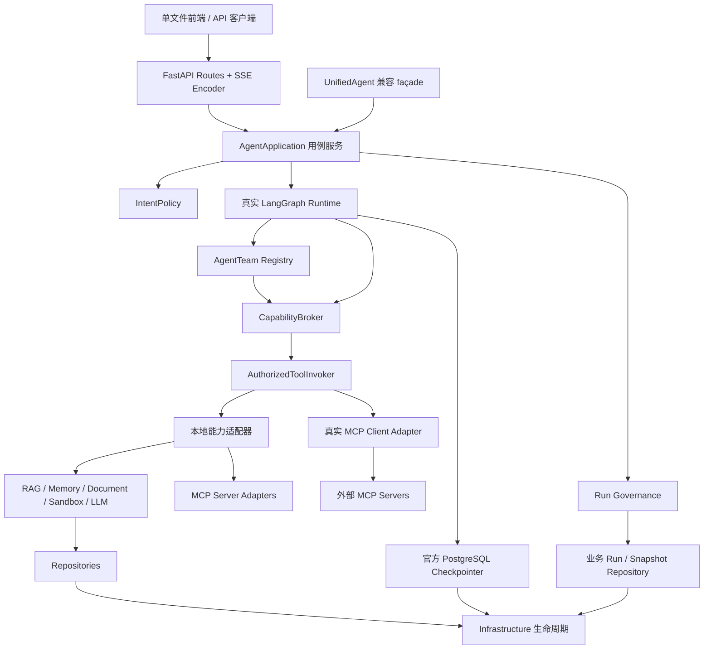
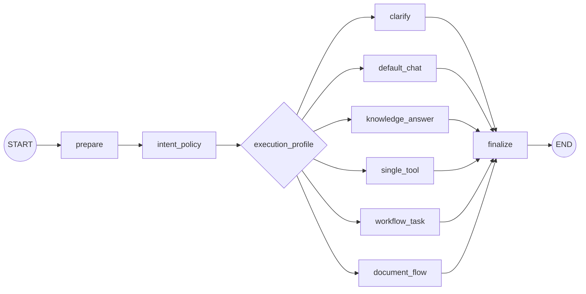

# VenAgent 重构目标架构

> 状态：已接受  
> 日期：2026-07-18  
> 产品依据：[VenAgent 重构 PRD](../02-requirements/PRD/venagent-refactor.md)  
> 现状依据：[VenAgent 重构现状审计](../01-research/technical-audit.md)

## 一、架构决策摘要

VenAgent 采用以下目标形态：

> **模块化单体 + 内部应用 Ports + 本地/MCP 双适配器 + 真实同步 LangGraph + 独立 PostgreSQL checkpoint + 默认拒绝的能力授权。**

核心决定：

1. MCP 是边界互操作协议，不是所有进程内调用的 wire protocol。
2. RAG、memory、document、sandbox、repo、infra 底座保留，通过内部 Ports 暴露。
3. 使用真实 LangGraph 逐 profile 替换自研 `GraphRuntime`，不再扩展本地同名兼容壳。
4. 当前同步 LLM、数据库和工具栈继续保留；真实 LangGraph 先采用同步 API，SSE 继续由 worker thread 桥接。
5. LangGraph checkpoint 与业务 run/snapshot 分表、分生命周期管理。
6. AgentTeam 的能力权限由集中授权器执行，而不是只写在 contract 中。
7. `UnifiedAgent` 最终收缩为兼容 façade；Handler 只依赖应用用例。
8. AGI-saber 冻结为行为参考，不作为持续代码上游。

## 二、目标组件图



## 三、控制平面与能力平面

### 3.1 控制平面

控制平面拥有：

- IntentPolicy；
- LangGraph 图、节点路由、并行和恢复；
- RunGovernance；
- AgentTeam 注册与调度；
- capability 授权；
- planner、checkpoint、resume、cancel 和审批；
- runtime event。

控制平面不得实现 RAG 算法、记忆存储、文档持久化、数据库查询或 sandbox 细节。

### 3.2 能力平面

能力平面拥有：

- RAG 查询与入库；
- memory recall/write；
- document list/read/write/ingest；
- search、weather、time；
- sandbox command execution；
- LLM 与 embedding；
- repository 和 event publisher。

这些能力通过 Ports 提供给控制平面，并可由本地或 MCP adapter 实现。

## 四、内部 Ports 与 MCP

### 4.1 为什么内部不全部走 MCP

如果同进程 RAG、memory、document 也强制经过 MCP transport，会带来：

- 无意义的序列化与延迟；
- 新的网络/会话故障域；
- 类型和事务边界退化；
- 测试复杂度增加；
- 过早分布式化。

因此 PRD 的“全部通过 MCP 暴露”解释为：

- 能力均可通过真实 MCP server adapter 对外暴露；
- 外部工具通过真实 MCP client adapter 接入；
- 上层只依赖统一能力契约，不直接依赖后端实现；
- 进程内调用可使用相同契约的本地适配器。

### 4.2 Canonical capability contract

建议建立：

- `CapabilityDescriptor`
  - 稳定 ID、名称和版本；
  - JSON Schema；
  - side-effect/risk level；
  - timeout/retry policy；
  - 所属 adapter 和健康状态。
- `CapabilityCall`
  - arguments；
  - request/run/thread identity；
  - 服务端认证上下文注入的 `tenant_id`、`principal_id` 和 run owner；
  - caller preset；
  - deadline；
  - idempotency key；
  - approval evidence。
- `CapabilityResult`
  - success/is_error；
  - structured content；
  - safe model content；
  - stable error code；
  - latency/attempt/audit metadata。

### 4.3 真正 MCP client

至少支持：

1. 受控 endpoint 配置；
2. stdio 或 Streamable HTTP transport；
3. `ClientSession.initialize()`；
4. `list_tools()` 与 catalog cache；
5. `call_tool()`；
6. 标准内容、structured content 和 `isError` 转换；
7. session 重连和关闭；
8. 认证引用、日志脱敏；
9. scheme/host/IP/redirect allowlist 与 SSRF 防护；
10. timeout、并发、响应大小和审计限制。

用户或模型只能选择已注册的 server ID，不能提交任意 URL。

### 4.4 真正 MCP server

本轮成功标准必须提供 MCP server adapter，使 PRD 指定的内部能力能够经标准 MCP 工具发现和调用。第一批必做、默认只读：

- RAG 查询；
- memory 搜索与受策略控制的记忆读写；
- document list/read，以及经审批的 document write/ingest；
- status 查询；
- 外部工具的标准化代理入口。

带副作用能力必须额外授权；`exec_command` 不得作为无门禁通用 MCP tool。MCP server adapter 可以按风险分批启用，但 RAG、memory、document 和外部工具四类均纳入本轮最终验收，不能以“可选”状态关闭整个 Phase。

## 五、IntentPolicy

### 5.1 输入

`IntentSignal` 目标增加或明确：

- query；
- request/user/conversation context；
- selected capabilities；
- capability health；
- AgentTeam registry snapshot；
- memory/recovery availability；
- explicit user constraints；
- deployment policy。

### 5.2 输出必须被执行

`IntentDecision` 的以下字段都必须成为运行时输入：

- `execution_profile`：选择主图入口；
- `graph_entry`：选择节点/子图；
- `prompt_schema_key`：选择 prompt context schema；
- tool scope：过滤 planner，并在 executor 再授权；
- agent scope：限制可调度 preset；
- memory scope：限制读写；
- recovery policy：决定 durable/non-durable/interrupt；
- `clarify_needed`：进入专用澄清节点，而不是普通聊天。

### 5.3 迁移策略

保留关键词规则作为 deterministic fallback，但移除对 legacy `router.py` 的直接依赖。策略可按优先级组合：

1. 显式用户选择；
2. 安全/部署策略；
3. 确定性高置信规则；
4. 可选结构化模型分类；
5. 低置信澄清。

每个决定记录 policy version、reason 和 confidence。

## 六、真实 LangGraph

### 6.1 主图



主图在 bootstrap 时编译一次。动态 plan 作为可序列化 state，由稳定 scheduler/fan-out 子图执行；不为每次请求重新定义一套不可审计的主图结构。

### 6.2 状态

状态只保存可序列化数据：

- IDs 与版本；
- 序列化 IntentDecision；
- plan 与 node 状态；
- capability call/result；
- artifact 引用；
- approval/cancel 状态；
- answer、steps 和安全错误。

禁止放入连接、client、repo、Tool 对象、锁、线程、callback、token 和秘密。

并行更新字段必须定义确定性 reducer。节点结果建议按 `node_id` 合并，避免 resume 时重复 append。

### 6.3 身份

| ID | 语义 |
|---|---|
| `tenant_id` | 服务端认证域/租户，客户端不得声明或覆盖 |
| `principal_id` | 当前认证主体，所有 run 操作的授权依据 |
| `request_id` | 一次 HTTP/SSE 传输关联 |
| `run_id` | 一次业务执行，使用 UUID，并绑定 tenant/owner |
| `thread_id` | LangGraph checkpoint namespace；由服务端按 tenant/run 映射，不直接接受客户端值 |
| `checkpoint_id` | 框架管理的具体恢复版本，不直接作为公共对象 ID |
| `conversation_id` | 未来多轮持久图需要时单独引入 |

公共 API 只接受 `run_id`。应用层必须先按 `tenant_id + principal_id + run_id` 查询并执行对象级授权，再解析内部 `thread_id/checkpoint_id`。任何主体都不得发现、读取、订阅、取消、恢复或审批其他租户/所有者的 run；拒绝响应不泄露目标是否存在。

### 6.4 checkpoint 与 snapshot

- 官方 PostgreSQL checkpointer 保存框架运行状态，并使用 tenant-scoped namespace；
- 业务 `agent_runs`/snapshot 保存用户和运维可读的状态、进度、结果与审计摘要，并强制 tenant/owner 过滤；
- 两者不共表，不互相模拟；
- resume/cancel/list/status/SSE reconnect/approval 均先做对象级授权，再访问内部 checkpoint；
- checkpoint、审批证据、capability audit 与 MCP 调用继承同一 tenant/principal/run 绑定。

单元测试使用官方内存 saver；生产 durable workflow 使用官方 PostgreSQL saver。

### 6.5 interrupt、resume 与 cancel

- 人工批准：节点中 `interrupt()`；
- 用户确认/拒绝：相同 thread 通过 `Command(resume=...)`；
- 取消：RunGovernance 的业务状态和终止路由，不等同于 interrupt；
- 每个 run 独立取消，不再 `cancel_all()`；
- checkpoint 记录 graph/policy/preset/state schema version。

### 6.6 副作用幂等

恢复不能保证 exactly-once。以下调用必须使用幂等键：

- document write/ingest；
- memory write；
- event publish；
- sandbox 或外部 MCP 副作用工具。

建议键：`run_id + node_id + logical_attempt`。

## 七、AgentTeam

### 7.1 Canonical roles

| PRD role | 当前实现映射 | 目标语义 |
|---|---|---|
| `research` | `research_agent` | 只读 search/RAG，整理证据 |
| `doc_qa` | 当前无真正等价物 | 只读 document/RAG 问答 |
| `synthesis` | `writer_agent` 为 draft variant；`review_agent` 为 review variant | 汇总、写作和审查，不直接副作用 |
| `ops` | `doc_agent` 为 persist_document operation | 受控写文档、入库；命令执行需额外审批 |

`doc_agent` 不能直接重命名为 `doc_qa`，因为当前行为是写入和入库。

### 7.2 权限交集

有效权限是：

> IntentPolicy scope ∩ Preset contract ∩ deployment policy ∩ user authorization ∩ runtime approval ∩ capability health

任意一层为空则拒绝，默认 deny。

planner 只能看到过滤后的能力；executor 每次调用前重新授权。

### 7.3 自定义 Agent 注册与发现

- 自定义 preset 使用与内置 preset 相同的版本化 contract 注册；
- registry 在 bootstrap 时校验 ID/role/variant 唯一性、schema、capability 和 memory policy；
- registry snapshot 进入 IntentPolicy 和 LangGraph 调度上下文；
- 新增角色不要求修改主图或 `UnifiedAgent`，只需注册 contract 和 runner；
- 动态注册默认仅允许受信配置或管理面，不能由普通对话输入直接创建可执行 Agent。

### 7.4 Sandbox 安全契约

`sandbox` 是独立安全边界，不能因为工具已经经过 capability 授权或 MCP adapter 就被视为天然安全：

- 默认拒绝，命令/执行类型使用显式 allowlist；
- 只暴露受控工作区，阻断路径穿越、宿主机敏感路径、配置文件、secret、凭据环境变量和 Docker socket；
- 网络默认关闭；确需访问时按 capability 使用目标 allowlist 和部署层 egress policy；
- 强制 CPU、内存、PID、执行时间、输出大小和并发配额；
- 输出、错误与审计日志脱敏；
- 审批证据绑定 tenant、principal、run、capability、参数摘要、有效期与一次性使用状态；
- MCP 调用必须经过相同的 sandbox、授权、审批和审计链，不能直接旁路执行器。

### 7.5 Contract 目标

结构化 contract 包含：

- preset ID、role、variant、version；
- input/output schema；
- capability allowlist；
- memory read/write scope；
- retrieval scope；
- side-effect level；
- approval requirement；
- timeout/retry policy；
- durable/resumable 标志。

runner 不再接收整个 `UnifiedAgent`，而接收受限 `PresetContext` 和 `AuthorizedToolInvoker`。

## 八、配置与 Bootstrap

### 8.1 配置覆盖顺序

1. 代码安全默认值；
2. 共享 YAML；
3. 本机 `config.local.yaml`；
4. 白名单环境变量；
5. 启动参数字段覆盖。

规则：

- mapping 深度合并；
- list 整体替换；
- 未知字段和类型错误启动失败；
- 配置装配后只读；
- secret 只来自 local/env/secret reference；
- 日志与状态接口自动脱敏；
- 可选基础设施失败产生 health/capability 降级，不影响无关能力。

### 8.2 Bootstrap 阶段

1. 加载并校验配置；
2. 初始化 Infrastructure；
3. 装配 repositories；
4. 初始化 checkpointer；
5. 装配本地 capability adapters；
6. 连接 MCP servers 并发现工具；
7. 构建 capability catalog/broker；
8. 注册和验证 presets；
9. 编译 LangGraph；
10. 构建 application 与 UnifiedAgent façade；
11. 注册 routes；
12. shutdown 反序关闭。

使用 FastAPI lifespan 管理。独立基础设施可并行初始化，但并发逻辑属于 bootstrap，不在 Agent 构造器中。

## 九、应用与 HTTP 边界

### 9.1 Application use cases

建议提供：

- process request；
- stream request；
- resume run；
- cancel run；
- get/list run；
- document use cases；
- memory/status/tool catalog；
- register/list MCP server。

### 9.2 Handler

Handler 只负责：

- Pydantic HTTP schema；
- 鉴权/授权入口；
- use case 调用；
- RuntimeEvent → SSE；
- application error → safe HTTP error；
- 静态前端挂载。

不得直接访问 `agent.inf.repo`、`agent.stm/ltm/preference` 或 LangGraph 内部 chunk。

### 9.3 兼容契约

继续保护：

- `/api/chat`；
- `/api/chat/stream`；
- `/api/chat/cancel`；
- `/api/documents...`；
- `/api/upload`；
- `/api/tools` 与 `/api/tools/mcp`；
- `/api/status`、`/api/memory`、`/api/snapshots`、`/health`。

SSE 保证 start 首发、route/done 单例、token 顺序、相同 request ID、`[DONE]` 终止和断开后的 per-run cancel。

Phase 0 生成 OpenAPI schema 基线；路由/schema 拆分和 canonical 入口切换时执行结构化 diff，任何破坏性差异必须先更新契约并获得确认。

## 十、目录演进建议

目标源码不再长期集中在 `final/`。采用仓库级 `apps/ + src/venagent/ + tests/ + config/ + deploy/` 布局，`final/` 只作为迁移期兼容壳：

```text
VenAgent/
├── apps/                    # API 与 Web 可运行入口
├── src/venagent/            # application/orchestration/capability/core/adapters
├── tests/                   # unit/contract/architecture/integration/e2e
├── config/                  # 共享模板与 ignored local 配置
├── deploy/                  # Compose 与部署资产
├── docs/
└── final/                   # 迁移期兼容壳，Phase 7 删除
```

完整目录树、依赖方向、当前路径映射和迁移门禁见 [VenAgent 目标目录层次与迁移边界](./venagent-target-directory-structure.md)。目录迁移按 Phase 进行，不做无测试保护的整树搬家；新包不得反向导入 `final`。

## 十一、拒绝的方案

- 所有内部调用强制走 MCP；
- 继续把本地兼容壳称为 LangGraph；
- 用 `task_snapshots` 自研官方 checkpointer；
- 本轮同时重写全部 async I/O；
- 权限只记录在 contract，不在 executor 执行；
- 把 `doc_agent` 直接改名为 `doc_qa`；
- 继续把 UnifiedAgent 当 service locator；
- 同时 shadow 执行带副作用的新旧图；
- 持续同步 AGI-saber；
- 继续把所有新代码堆入 `final/internal/`；
- 现在拆微服务。

## 十二、建议 ADR

| ADR | 标题 |
|---|---|
| ADR-001 | internal-ports-mcp-edge-adapters |
| ADR-002 | adopt-real-langgraph-sync-runtime |
| ADR-003 | separate-checkpoints-from-business-snapshots |
| ADR-004 | versioned-run-identity-and-governance |
| ADR-005 | deny-by-default-capability-broker |
| ADR-006 | canonical-prd-agentteam-presets |
| ADR-007 | layered-immutable-configuration |
| ADR-008 | staged-bootstrap-fastapi-lifespan |
| ADR-009 | stable-http-sse-compatibility-boundary |
| ADR-010 | idempotent-side-effect-nodes |
| ADR-011 | freeze-agi-saber-reference |
| ADR-012 | profile-based-strangler-cutover |
| ADR-013 | target-src-layout-and-final-retirement |

实施路线与门禁见 [重构路线图](../04-planning/roadmap.md)。
