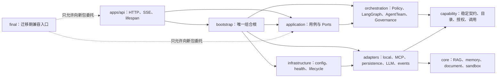

# VenAgent 目标目录层次与迁移边界

> 状态：已接受  
> 日期：2026-07-18  
> 上位设计：[VenAgent 重构目标架构](./venagent-refactor-target-architecture.md)  
> 实施路线：[VenAgent 重构路线图](../04-planning/roadmap.md)

## 一、结论

`final/` 继续作为当前实现事实源，但不再作为重构后所有代码的永久容器。目标采用仓库级 `src` 布局：

- `apps/` 保存可运行入口和前端；
- `src/venagent/` 保存可导入的 Python 业务包；
- `tests/`、`config/`、`deploy/` 与源码平级；
- `final/` 只在迁移期保留兼容入口和尚未迁移的旧模块，Phase 6 稳定发布窗口后删除；
- 目录迁移服从架构边界，不做一次性整树搬家。

## 二、目标目录层次图

```text
VenAgent/
├── apps/
│   ├── api/
│   │   ├── main.py                 # FastAPI 应用工厂与进程入口
│   │   ├── lifespan.py             # 启动/关闭生命周期适配
│   │   ├── schemas/                # HTTP/SSE Pydantic schema
│   │   └── routes/                 # 轻量 HTTP/SSE 路由
│   └── web/
│       └── index.html              # 当前单文件前端及后续静态资源
├── src/
│   └── venagent/
│       ├── application/
│       │   ├── services/           # process/stream/resume/cancel 等用例
│       │   ├── ports/              # repo、run、document 等应用 Port
│       │   └── dto/                # 与框架无关的用例输入输出
│       ├── orchestration/
│       │   ├── policy/             # IntentPolicy 与确定性 fallback
│       │   ├── langgraph/          # 真实 LangGraph 图、state、node、reducer
│       │   ├── agentteam/          # preset contract、registry、runner
│       │   └── governance/         # run、checkpoint、resume、cancel、approval
│       ├── capability/
│       │   ├── contracts/          # Descriptor/Call/Result
│       │   ├── catalog/            # 能力发现与健康目录
│       │   ├── broker/             # 权限交集与 adapter 选择
│       │   └── invoker/            # executor 二次授权
│       ├── core/
│       │   ├── rag/                # 保留的 RAG 领域能力
│       │   ├── memory/             # 保留的记忆能力
│       │   ├── document/           # 保留的文档能力
│       │   └── sandbox/            # 独立安全边界
│       ├── adapters/
│       │   ├── local/              # 进程内能力适配器
│       │   ├── mcp/                # MCP client/server edge adapters
│       │   ├── persistence/        # PostgreSQL/ES/Milvus/Kafka/Neo4j repo
│       │   ├── llm/                # provider-neutral LLM/embedding adapter
│       │   └── events/             # 事件发布适配器
│       ├── infrastructure/
│       │   ├── config/             # 分层、不可变配置
│       │   ├── health/             # capability health 与降级状态
│       │   └── lifecycle/          # 基础设施资源生命周期
│       ├── bootstrap/              # 依赖装配、图编译、preset 注册
│       └── compatibility/          # 有时限的 legacy façade/alias
├── config/
│   ├── config.yaml                 # 可跟踪的安全共享模板
│   └── config.local.yaml           # 本机覆盖，必须被忽略
├── tests/
│   ├── unit/
│   ├── contract/
│   ├── architecture/
│   ├── integration/
│   └── e2e/
├── deploy/
│   ├── docker-compose.yml
│   └── docker/
├── scripts/                        # 可复现的维护/验证脚本
├── docs/
├── final/                          # 迁移期兼容壳；不得继续承接新边界
├── requirements.txt                # Phase 6 后的根运行时依赖入口
└── README.md
```

## 三、目录依赖方向



依赖规则：

1. `bootstrap` 是唯一允许同时看到具体 adapter、基础设施和应用服务的组合根。
2. `apps/api/routes` 只调用 application use case，不穿透 agent、repo、RAG 或 LangGraph state。
3. `orchestration` 只依赖 capability contract 和 application Port，不依赖具体数据库或 MCP transport。
4. `core` 不导入 FastAPI、LangGraph、MCP SDK 或具体仓储连接。
5. `adapters` 实现 Port，不把连接、client、token 或框架对象泄露给上层。
6. `final` 兼容代码只能委托新包；禁止新包反向导入 `final`，以免形成永久循环依赖。

## 四、当前目录到目标目录的映射

| 当前路径 | 目标路径 | 迁移说明 |
|---|---|---|
| `final/main.py` | `apps/api/main.py`、`src/venagent/bootstrap/` | 当前入口先变薄，最后切换 canonical 入口 |
| `final/internal/handler/` | `apps/api/routes/`、`schemas/` | HTTP 适配与业务用例分开 |
| `final/internal/agent/policy/` | `src/venagent/orchestration/policy/` | 保留结构化 DTO，移除 legacy router 依赖 |
| `final/internal/agent/langgraph/`、`graph_runtime.py` | `src/venagent/orchestration/langgraph/` | 迁移到官方 LangGraph，不搬运同名兼容壳 |
| `final/internal/agentteam/` | `src/venagent/orchestration/agentteam/` | canonical role、contract、registry、runner 收口 |
| `final/internal/tools/` | `src/venagent/capability/`、`adapters/local/`、`adapters/mcp/` | 契约、授权与 transport 分离 |
| `final/internal/rag/`、`memory/`、`document/`、`sandbox/` | `src/venagent/core/` | 保留领域逻辑，通过 adapter 暴露 |
| `final/internal/repo/` | `src/venagent/adapters/persistence/` | 所有持久化实现继续位于 repo 边界 |
| `final/internal/infra/` | `src/venagent/infrastructure/` | 连接生命周期与健康模型收口 |
| `final/config/` | `config/`、`src/venagent/infrastructure/config/` | 配置数据与配置装配代码分开 |
| `final/frontend/index.html` | `apps/web/index.html` | 保持单文件前端兼容 |
| `final/tests/` | `tests/` | 按 unit/contract/architecture/integration/e2e 分层 |
| `final/docker-compose.yml` | `deploy/docker-compose.yml` | Phase 6 更新路径和启动说明 |

## 五、渐进迁移顺序

1. **Phase 0**：仍在 `final/` 上建立安全与行为基线，不做目录搬迁。
2. **Phase 1**：建立 `src/venagent`、`apps/api` 和 bootstrap 骨架；`final/main.py` 保持可运行并向新入口委托。
3. **Phase 2～5**：按 Ports、授权、LangGraph、AgentTeam、MCP 的边界逐个迁移；每次迁移都先有 contract/characterization tests。
4. **Phase 6**：`apps/api/main.py` 成为 canonical 入口，测试、配置和部署文件移至根级目录；`final/` 仅保留一个稳定发布周期的兼容壳。
5. **Phase 7**：确认无生产引用、旧 run 已完成或有迁移策略后删除 `final/`。

任何阶段都不得仅为“目录整齐”移动尚未建立测试保护的模块。

## 六、目录门禁

- 新架构代码不得新增到 `final/internal/`；只允许缺陷修复和兼容委托。
- 禁止 `src/venagent/**` 导入 `final/**`。
- `apps/api/routes/**` 不得导入具体 repo、RAG、MCP client 或 LangGraph 内部 state。
- `core/**` 不得导入 FastAPI、LangGraph、MCP SDK 或基础设施连接。
- 迁移期间必须同时验证旧入口与新入口的 HTTP、SSE 和 OpenAPI 契约。
- Phase 6 前不得删除 `final/`；Phase 7 删除前必须通过全量测试和关键 E2E。
