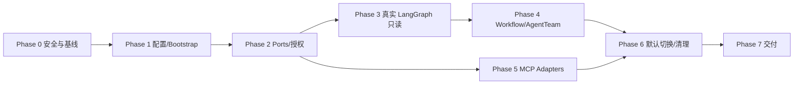

# VenAgent 重构路线图

> 状态：已确认，Phase 1 Sprint 04 已完成；Phase 1 已完成
> 日期：2026-07-18  
> 需求：[VenAgent 重构 PRD](../02-requirements/PRD/venagent-refactor.md)  
> 设计：[VenAgent 重构目标架构](../03-design/venagent-refactor-target-architecture.md)  
> 目录：[VenAgent 目标目录层次与迁移边界](../03-design/venagent-target-directory-structure.md)  
> 任务清单：[VenAgent 重构任务清单](./venagent-refactor-task-list.md)

## 一、路线原则

1. 先修安全与事实基线，再迁移架构。
2. 以 VenAgent 当前源码与测试为实现事实源；AGI-saber 只作冻结行为参考。
3. 按 execution profile 渐进切换，先只读路径，后副作用工作流。
4. 真实 LangGraph、真实 MCP 和 AgentTeam 权限分阶段落地，避免一次同时替换所有层。
5. checkpoint 与业务 snapshot 分离。
6. 每个阶段都保留显式回滚点；新数据库结构一律 additive。
7. HTTP API、前端和 SSE 外部契约默认不变。
8. 新功能/缺陷执行阶段严格使用 TDD；代码修改后执行 Python、通用、FastAPI 或安全审查。
9. 新架构代码进入 `src/venagent/` 与 `apps/`；`final/` 只作为当前事实源和有时限兼容壳。

## 二、里程碑总览

| Phase | 名称 | 核心交付 | 状态 | 依赖 |
|---|---|---|---|---|
| 0 | 安全、冻结与基线 | 凭据处置、行为/测试/性能基线、依赖 spike | 基线完成；遗留卡片独立跟踪 | 无 |
| 1 | 配置与 Bootstrap | `src/apps` 骨架、完整配置分层、lifespan、显式 container | 已完成（P1-11 `.env` 注入收口） | Phase 0 |
| 2 | Ports、能力目录与授权 | 内部契约、CapabilityBroker、canonical presets | 待开始 | Phase 1 |
| 3 | 真实 LangGraph 只读切片 | 官方图、官方 saver、chat/RAG/clarify 切换 | 待开始 | Phase 2 |
| 4 | 工具、Workflow 与 AgentTeam | 单工具、并行、resume、幂等、副作用迁移 | 待开始 | Phase 3 |
| 5 | 真实 MCP Adapters | 官方 MCP client/server、受控 registry | 待开始 | Phase 2；推荐 Phase 4 后切默认 |
| 6 | 默认切换与 Legacy 清理 | 全 profile 切换、拆 Handler、切换 canonical 目录入口 | 待开始 | Phase 3-5 |
| 7 | 交付与旧目录退役 | 全量验证、审查、发布记录、稳定窗口后删除 `final` | 待开始 | Phase 6 |

## 三、Phase 0：安全、冻结与基线

### 目标

消除阻塞性安全风险，并把当前可用行为固化为后续迁移门禁。

### 工作包

1. 确认 AGI-saber 仅作为静态行为参考，不纳入 VenAgent 运行、部署或同步路径。
2. 扫描 VenAgent 全 refs 和历史；历史凭据由仓库所有者授权后完成重写。
3. 移除 VenAgent tracked 配置/Compose 中可直接使用的默认凭据；真实值移至 ignored local/env/secret。
4. 验证并补齐 `config.local.yaml`、`.env*` ignore；不得依赖 `assume-unchanged`。
5. 固定 AGI-saber 行为参考版本和 upstream 冻结 ADR。
6. 运行 VenAgent 全量 pytest、compileall；若 pytest-cov 可用再运行覆盖率。
7. 为 HTTP/SSE/OpenAPI/chat/RAG/tool/document/取消/恢复建立 characterization tests；SSE 只记录当前 legacy 伪流式行为作为基线，不把它冻结为重构目标。
8. 记录当前 legacy 基线：启动时间、现有 TTFT/完成时间和 graceful degradation；真流式指标在 Phase 3 实现后再测量。
9. 用隔离 spike 核对并固定 Python 3.11、FastAPI/Pydantic、LangGraph、checkpoint Postgres 和 MCP SDK 版本；未经批准不添加依赖。
10. 修复或单独建卡处理已确认 legacy 缺陷：重复方法、秒级 task ID、删除文档虚假成功、全局取消、错误泄露、CORS。
11. 生成并确认 ADR-001/003/004/007/011/012/013，冻结 Ports、checkpoint、身份、配置、迁移和目标目录决策。

### 主要文件

- `final/config/config.yaml`
- `final/docker-compose.yml`
- `.gitignore`、`final/.gitignore`
- `final/tests/`
- `docs/01-research/technical-audit.md`
- `docs/03-design/ADR/`

### 门禁

- [x] AGI-saber 已确认仅为静态参考，不纳入 VenAgent 运行、部署或同步路径。
- [x] VenAgent 本地与 GitHub refs/历史已扫描并完成清理。
- [x] 跟踪文件不含真实 API Key/Token/可部署默认密码。
- [x] local secret 文件被 ignore 且未 tracked。
- [x] `cd final && python -m pytest tests` 通过（240 passed，网络熔断已启用）。
- [x] legacy coverage 基线已记录（59%）；[ ] 后续重构关键路径需达到 80% 质量目标。
- [x] `python -m compileall -q final` 通过。
- [x] characterization tests 覆盖现有外部契约，并明确标注 legacy 伪流式行为不作为新目标。
- [ ] OpenAPI schema 已生成基线，后续路由拆分可做结构化差异验证。
- [ ] 锁定版本 spike 通过；添加依赖范围已获批准。
- [ ] 无未处置 CRITICAL/HIGH 安全问题。

### 回滚

本阶段不切换运行行为。凭据轮换不可回滚到旧值。

## 四、Phase 1：配置与 Bootstrap 分离

### 目标

让配置覆盖顺序可解释，让副作用从构造器迁移到应用生命周期。

### 工作包

1. 定义不可变配置模型和字段级环境变量映射。
2. 实现安全默认→共享 YAML→local YAML→env→CLI 的深度合并。
3. mapping 深度合并、list 整体替换；未知字段和类型错误 fail fast。
4. 建立 `src/venagent/`、`apps/api/` 骨架并提取 `Bootstrapper`/dependency container。
5. 将 Infrastructure、checkpointer provider、capability、AgentTeam、runtime、app 作为显式阶段装配。
6. 使用 FastAPI lifespan 初始化和反序关闭。
7. 将 `_bootstrap_concurrent()` 从 `UnifiedAgent` 移到 bootstrap。
8. 保留 `APIConfig`、`build_deps()` 和现有 Handler 的兼容 façade；`final/main.py` 只向新入口委托。
9. 启动诊断按阶段返回脱敏错误和 capability health。

### 主要文件

- CREATE `src/venagent/infrastructure/config/`
- CREATE `src/venagent/infrastructure/lifecycle/`
- CREATE `src/venagent/bootstrap/`
- CREATE `apps/api/lifespan.py`
- UPDATE `final/config/config.py`、`final/main.py`（迁移期兼容）
- UPDATE `final/internal/agent/agent.py`（移除构造副作用）
- CREATE/UPDATE 配置与启动测试

### 门禁

- [ ] 覆盖顺序、深度合并、list 替换、未知字段、secret redaction 测试通过。
- [ ] 无任何可选基础设施时仍按定义降级启动。
- [ ] `UnifiedAgent.__init__()` 不再创建连接、启动线程或执行恢复。
- [ ] shutdown 能关闭 memory writer、checkpointer、MCP session 和 infra。
- [ ] HTTP/SSE 外部 envelope、字段、结束语义保持兼容；token 时序允许从伪流式变为真流式，并有独立目标测试。
- [ ] `src/venagent/**` 不导入 `final/**`，旧入口只允许单向委托新包。

### 回滚

保留 legacy config/bootstrap feature flag 一个稳定发布周期；数据库变更保持 additive。

## 五、Phase 2：内部 Ports、能力目录与授权

### 目标

让编排和 preset 只依赖稳定契约，真正执行能力范围和权限。

### 工作包

1. 定义 RAG、memory、document、search、sandbox、LLM、run repository Ports。
2. 本地 adapters 委托现有底座，不改算法和存储。
3. 建立完整 JSON Schema 的 `CapabilityDescriptor/Call/Result`。
4. 建立 `CapabilityCatalog`、health 和 adapter selector。
5. 建立 `CapabilityBroker` 与 `AuthorizedToolInvoker`。
6. 对 run/list/status/resume/cancel/SSE reconnect/approval 实施 tenant/owner 对象级授权；tenant/principal 仅从服务端认证上下文注入。
7. 权限实施为 Policy ∩ Preset ∩ Deployment ∩ User ∩ Approval ∩ Health。
8. planner 只获得过滤后的 catalog；executor 再授权。
9. 重构 AgentTeam contract 为结构化 schema/policy。
10. runner 不再接收整个 `UnifiedAgent`，改为受限 `PresetContext`。
11. 建立 canonical roles：research、doc_qa、synthesis、ops；旧名称作 alias/variant。
12. 建立自定义 Agent 注册/发现契约，确保新角色无需修改主流程即可进入 catalog 和编排。
13. 让 `IntentDecision` 的 agent/memory/recovery scope 真正参与执行。
14. 添加架构依赖测试，禁止 preset/graph 直接导入具体 repo/RAG/agent 实现。
15. 定义 Sandbox 安全契约：默认拒绝、受控工作区、无 secret/Docker socket、网络默认关闭、资源配额、输出脱敏和一次性审批证据。
16. 实现独立的业务 Run/Snapshot Repository、additive schema migration 和 tenant/owner 查询；不得用 checkpoint 表替代业务 projection。

### 主要文件

- CREATE `src/venagent/application/ports/`
- CREATE `src/venagent/capability/`
- CREATE `src/venagent/adapters/local/`
- CREATE `src/venagent/adapters/persistence/agent_run.py`
- CREATE `src/venagent/orchestration/policy/`
- CREATE `src/venagent/orchestration/agentteam/`
- UPDATE `final/internal/**`（仅兼容委托，不新增目标边界）
- CREATE 权限、contract、conformance、架构测试

### 门禁

- [ ] research 不能写文档或执行命令。
- [ ] doc_qa 默认为只读。
- [ ] synthesis 无副作用工具。
- [ ] ops 的副作用需显式授权；exec_command 需审批。
- [ ] run/list/status/resume/cancel/SSE reconnect/approval 均执行 tenant/owner 对象级授权，跨租户请求不泄露目标存在性。
- [ ] planner 与 executor 双重门禁的负面测试通过。
- [ ] Sandbox 不能读取宿主机秘密/配置/Docker socket、不能访问未授权网络，且超时、资源超限与超大输出被安全终止。
- [ ] adapter 替换不要求修改上层 graph/preset。
- [ ] 现有 RAG/document/memory 行为测试继续通过。
- [ ] 业务 run/snapshot 与 checkpoint 分表，schema migration 可前滚和安全回退。

### 回滚

local adapter 继续委托旧实现；可按 profile 关闭新 broker，但安全拒绝规则不应无审查回退。

## 六、Phase 3：真实 LangGraph 只读切片

### 目标

用官方 LangGraph 和官方 checkpointer 接管澄清、聊天和 RAG，并在本 Phase 明确上游真流式响应的迁移边界，不触碰副作用工作流。

### 工作包

1. 经批准添加锁定的 LangGraph 和 checkpoint 依赖。
2. 删除或更名本地同名 `langgraph` 兼容壳，防止误导和 import shadowing。
3. 定义版本化、可序列化 state schema 和 RuntimeEvent。
4. 建立静态主图：prepare→policy→conditional profile→finalize。
5. 实现专用 clarify 节点。
6. 迁移 default_chat 和 knowledge_answer。
7. 单元测试使用官方内存 saver。
8. 生产使用官方 PostgreSQL saver，独立于业务 snapshot。
9. `run_id/thread_id` 使用 UUID；记录 graph/policy/state version。
10. Handler/SSE 只消费稳定 RuntimeEvent，不暴露 LangGraph chunk。
11. 在 RuntimeEvent/SSE adapter 设计中定义上游增量响应的接口边界；真流式实现作为独立迁移任务执行。
12. 提供 per-profile runtime feature flag。
13. 对只读路径执行 legacy/new shadow comparison；shadow 只比较结果和外部 envelope，不要求复刻 legacy 伪流式时序。

### 主要文件

- UPDATE `final/requirements.txt`（迁移期依赖入口，需用户批准）
- CREATE `src/venagent/orchestration/langgraph/`
- CREATE/UPDATE `src/venagent/orchestration/governance/`
- UPDATE `src/venagent/orchestration/policy/`
- UPDATE `apps/api/` RuntimeEvent/SSE adapter
- UPDATE `src/venagent/infrastructure/` checkpointer provider
- UPDATE `src/venagent/adapters/persistence/agent_run.py`
- UPDATE/REPLACE LangGraph/checkpoint/run repository tests

### 门禁

- [ ] 测试证明实际导入官方 LangGraph，而非项目本地类。
- [ ] 同 thread 可在进程重启后恢复；不同 thread 隔离。
- [ ] checkpoint 与业务 run/snapshot 独立。
- [ ] clarify/chat/RAG 结果与外部契约兼容。
- [ ] SSE start/route/token/progress/done 顺序和单例约束保持。
- [ ] RuntimeEvent/SSE adapter 为后续真流式迁移保留增量 token 接口；本 Phase 不要求生产路径完成真流式改造。
- [ ] PostgreSQL 不可用时，non-durable chat 可降级；durable workflow 不虚假承诺恢复。
- [ ] feature flag 可按 profile 回切 legacy。

### 回滚

按 profile 切回 legacy；官方 checkpoint 表保留，不进行破坏性删除。

## 七、Phase 4：单工具、Workflow 与 AgentTeam

### 目标

将工具、动态计划、并行、resume、AgentTeam 和文档工作流迁移到真实图。

### 工作包

1. 迁移 single_tool，执行前经 broker 重新授权。
2. 将 dynamic plan 保存为 state，使用稳定 scheduler/fan-out 子图。
3. 为并行字段定义确定性 reducer 和排序键。
4. 实现受控 retry 分类和 backoff。
5. 将 race group 改为分支级 winner/loser，不取消整个 run。
6. 使用 interrupt/Command resume 实现审批恢复。
7. 将 cancel 改为 per-run，新增 run status/list/resume/cancel 用例。
8. 迁移 research、doc_qa、synthesis、ops。
9. 最后迁移 document workflow 和其他副作用节点。
10. 对 document/memory/event/MCP side effect 实施幂等键。
11. 将 memory write、event publish 等后置处理迁移为固定图节点，不再散落在 Agent 中。
12. 恢复后禁止重复发送已确认的业务事件。
13. 旧 runtime 为切换前创建的 run 保留至少一个稳定发布周期。

### 主要文件

- UPDATE `src/venagent/orchestration/langgraph/`
- UPDATE `src/venagent/orchestration/agentteam/`
- UPDATE `src/venagent/capability/`
- UPDATE `src/venagent/core/document/`、`memory/` 与 persistence adapters
- UPDATE `apps/api/`
- DEPRECATE `final/internal/agent/graph_runtime.py`
- CREATE crash/resume/idempotency/concurrency/permission tests

### 门禁

- [ ] 每类节点可在前后注入崩溃并恢复。
- [ ] 副作用恢复后不重复。
- [ ] per-run cancel 不影响并发 run。
- [ ] race loser 不取消整个 run。
- [ ] 非重试错误 fail fast，临时错误按策略重试。
- [ ] AgentTeam 权限负面测试全部通过。
- [ ] 所有 profile 都可按版本恢复或明确拒绝恢复。

### 回滚

按 execution profile/graph version 回旧 runtime；禁止同时 shadow 执行有副作用的新旧路径。

## 八、Phase 5：真实 MCP Adapters

### 目标

在稳定 Ports 上实现可替换、可审计的真正 MCP client/server。

### 工作包

1. 经批准添加锁定的 MCP Python SDK 依赖。
2. 建立 endpoint 配置和 server registry；禁止模型/匿名用户提交任意 URL。
3. 实现 stdio/Streamable HTTP client lifecycle。
4. initialize→list_tools→catalog cache→call_tool。
5. 无损映射 input schema、structured content、resource/image 和 `isError`。
6. 实现 timeout、重连、session expiry、response size 和并发限制。
7. 实现认证引用、日志脱敏、scheme/host/IP/redirect allowlist 和 egress policy。
8. 建立 MCP server adapters 并由 FastAPI lifespan 管理 session manager；第一批交付 RAG 查询、memory 搜索、document list/read，随后在同一 Phase 内接入经审批的 memory/document 写入与外部工具代理。
9. `/api/tools/mcp` 保持外形兼容，但内部变为受控 registry service。
10. 单 capability 可在 local/mcp adapter 间切换，上层无代码变更。
11. `exec_command` 继续经过 sandbox 和审批，不因 MCP 化降低权限。
12. 为 time、weather、exec_command 建立 MCP 与现有 HTTP/UI 工具目录的契约兼容测试。

### 主要文件

- UPDATE `final/requirements.txt`（迁移期依赖入口，需用户批准）
- CREATE `src/venagent/adapters/mcp/`
- UPDATE `src/venagent/capability/`
- UPDATE `src/venagent/bootstrap/`
- UPDATE `apps/api/`
- DEPRECATE `new_mcp_tool()` 普通 HTTP shim
- CREATE MCP conformance/integration/security tests

### 门禁

- [ ] MCP server 可标准发现并调用 RAG、memory、document 和外部工具四类能力；副作用路径执行授权、审批和幂等门禁。
- [ ] initialize/list/call conformance 测试通过。
- [ ] handshake 未完成的 server 不进入 catalog。
- [ ] 单个 MCP server 故障不影响本地能力。
- [ ] SSRF、认证、日志、timeout 和 response size 测试通过。
- [ ] MCP `exec_command` 无审批拒绝，不能读取宿主机/秘密/Docker socket、不能访问未授权网络，且审批不可跨 tenant/principal/run 重放。
- [ ] adapter 切回 local 不需要改 graph/preset。
- [ ] 无外部 MCP 时应用正常降级。

### 回滚

按 capability 将 adapter 切回 local；不回滚 LangGraph 或 AgentTeam。

## 九、Phase 6：默认切换与 Legacy 清理

### 目标

所有 profile 默认进入新架构，收缩 façade 和适配层，删除旧运行路径。

### 工作包

1. 所有 profile 默认使用真实 LangGraph。
2. `UnifiedAgent` 仅保留兼容方法并委托 `AgentApplication`。
3. 拆分 Handler routes 和 schema。
4. Handler 不再穿透 agent/repo/memory 内部字段。
5. 移除生产路径对旧 router、GraphRuntime、本地 LangGraph 壳和旧 subagent shim 的依赖。
6. 清理重复方法、过期 alias、feature flag 和死代码。
7. 更新 API、codemap、架构文档和 ADR 状态。
8. 发布前执行完整测试、语法、覆盖率（若可用）、FastAPI、安全、真流式性能和 E2E 门禁。
9. 将 `apps/api`、`src/venagent`、根 `tests/config/deploy` 切为 canonical 入口；`final` 缩减为单向兼容壳。

### 门禁

- [ ] 生产主路径没有 legacy runtime 引用。
- [ ] application 不直接导入 repo/infra 实现。
- [ ] Handler 不访问 agent 内部字段。
- [ ] 文件规模、函数规模和错误处理符合项目规则。
- [ ] 全量测试及适用检查通过。
- [ ] 无 CRITICAL/HIGH 审查问题。
- [x] Phase 0 legacy 安全 mock/降级性能基线已记录；真流式性能门禁后置到 Phase 3/6。
- [ ] canonical 入口不依赖 `final`，旧入口仍可在兼容窗口内委托新应用。
- [ ] OpenAPI 与 Phase 0 基线无未批准的破坏性差异。

### 回滚

清理后使用上一稳定发布制品回滚；所有 schema/table 变更保持向后兼容。

## 十、Phase 7：交付

### 工作包

- 完成变更日志与发布说明；
- 输出迁移说明和运维手册；
- 标注 durable/non-durable capability；
- 记录已执行验证、跳过项和剩余风险；
- 在一个稳定发布周期后确认无生产、测试、部署和旧 run 引用，再删除 `final/` 兼容目录；
- 仅在用户授权后提交、推送或创建 PR。

## 十一、跨阶段依赖

MCP adapter 的开发可以在 Phase 2 后并行，但默认切换应等真实图和权限稳定后进行。

## 十二、主要风险与控制

| 风险 | 级别 | 控制 |
|---|---|---|
| 凭据已暴露 | CRITICAL | 立即撤销/轮换、历史扫描；不等待代码实施 |
| 误把兼容壳当 LangGraph | HIGH | 删除/更名本地壳；测试断言官方 import |
| checkpoint 与 snapshot 混用 | HIGH | 官方 saver 独立 schema/生命周期 |
| resume 重复副作用 | HIGH | 幂等键、业务去重和 crash tests |
| MCP SSRF/凭据泄露 | HIGH | 受控 registry、allowlist、认证引用、egress |
| AgentTeam 权限仅文档化 | HIGH | planner+executor 双门禁、默认拒绝 |
| 多层同时迁移难定位 | HIGH | 按 profile strangler、只读先行、feature flag |
| 同步 I/O 阻塞事件循环 | MEDIUM | 现有 worker bridge；非流式 use case 进入 threadpool，另行 async ADR |
| 双轨状态语义漂移 | MEDIUM | versioned run、characterization/conformance tests |
| AGI-saber 持续漂移 | MEDIUM | 冻结参考提交，白名单移植 |
| 外部服务不可用 | MEDIUM | capability health、显式 durable 降级语义 |

## 十三、用户确认后的第一执行单元

建议不要立刻进入真实 LangGraph。第一个实施单元应是 **Phase 0 安全与基线**：

1. 完成凭据轮换与秘密清理；
2. 运行当前测试/语法/可用覆盖率；
3. 固化 characterization tests；
4. 生成并确认 ADR-001、003、004、007、011、012、013；
5. 用隔离 spike 给出依赖版本锁定建议；
6. 再为 Phase 1 生成详细 TDD 任务卡。

未经明确确认，不修改生产代码、不添加依赖、不启动 Compose、不提交或推送。
